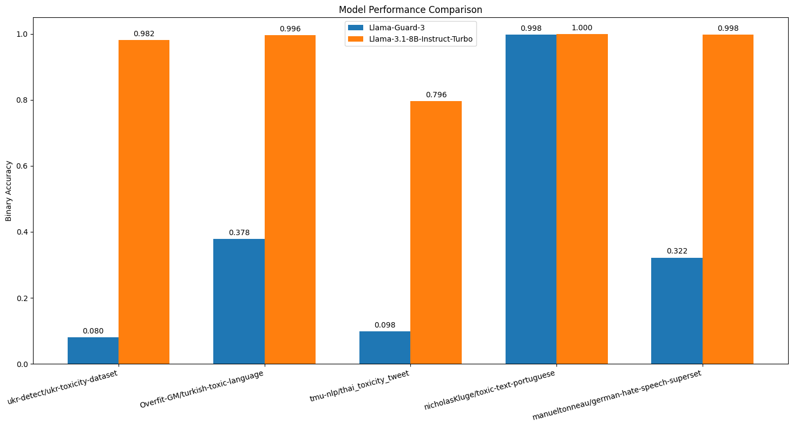

## Llama Guard Toxicity Analysis

This repository contains the code for our experiments with the Llama-Guard-3 model on the multilingual toxicity detection task. Through our experiments, we found that the Llama-Guard-3 underperformed as compared to the base models with a simple toxicity detection prompt. This repository further analyzes the results on 500 samples each from the toxic splits of popular English as well as multilingual toxicity datasets.

## Setting up your environment

This repository has only three dependencies. To install these, first create a virtual environment (we recommend python version >= 3.10) and activate it. Then run the following command:

```bash
pip install -r requirements.txt
```

This repository uses Together AI for querying the Llama models so please ensure to set your `TOGETHER_API_KEY`:

```bash
export TOGETHER_API_KEY="your_key_here"
```

## Executing the code

To run all experiments, please execute the following command:

```bash
bash run.sh
```

This script will create an `outputs/` directory which contains all the output CSV results. The script will also display the accuracy results for every dataset after the execution for that dataset is finished.

Feel free to change the `run.sh` parameters. You can use `--help` for more information on available commands.

## Results

<p float="left">
  
   
</p>

We observed that most of the heavy lifting for producing safe outputs is done by the base model itself, and adding Llama-Guard to the pipeline may be redundant. The Llama-3.1 paper tests the Llama-Guard-3 jointly with the Llama-3.1 but we observe that the Guard model is only able to improve safety for the Llama-3.1 on the xstest dataset and the base model outperforms the Guard model for every other dataset. We suspect that this is because the xstest dataset was part of the training examples for the Guard model.

## References

1. Ji, J., Liu, M., Dai, J., Pan, X., Zhang, C., Bian, C., ... & Yang, Y. (2024). Beavertails: Towards improved safety alignment of llm via a human-preference dataset. Advances in Neural Information Processing Systems, 36.
2. Li, L., Dong, B., Wang, R., Hu, X., Zuo, W., Lin, D., ... & Shao, J. (2024). Salad-bench: A hierarchical and comprehensive safety benchmark for large language models. https://aclanthology.org/2024.findings-acl.235.
3. Lin, Z., Wang, Z., Tong, Y., Wang, Y., Guo, Y., Wang, Y., & Shang, J. (2023). Toxicchat: Unveiling hidden challenges of toxicity detection in real-world user-ai conversation. https://aclanthology.org/2023.findings-emnlp.311/.
4. Kluge, N. (2022). Nkluge-correa/Aira-EXPERT: release v.01. Zenodo.
5. cjadams, Jeffrey Sorensen, Julia Elliott, Lucas Dixon, Mark McDonald, nithum, Will Cukierski. (2017). Toxic Comment Classification Challenge. Kaggle. https://kaggle.com/competitions/jigsaw-toxic-comment-classification-challenge
6. Röttger, P., Kirk, H. R., Vidgen, B., Attanasio, G., Bianchi, F., & Hovy, D. (2023). Xstest: A test suite for identifying exaggerated safety behaviours in large language models. arXiv preprint arXiv:2308.01263.
7. Tonneau, M., Liu, D., Fraiberger, S., Schroeder, R., Hale, S. A., & Röttger, P. (2024). From Languages to Geographies: Towards Evaluating Cultural Bias in Hate Speech Datasets. arXiv preprint arXiv:2404.17874.
8. Sirihattasak, S., Komachi, M., & Ishikawa, H. (2018, May). Annotation and classification of toxicity for Thai Twitter. In TA-COS 2018: 2nd Workshop on Text Analytics for Cybersecurity and Online Safety (p. 1).
9. Çöltekin, Ç. (2020, May). A corpus of Turkish offensive language on social media. In Proceedings of the Twelfth language resources and evaluation conference (pp. 6174-6184).
10. İ. Mayda, Y. E. Demir, T. Dalyan and B. Diri, "Hate Speech Dataset from Turkish Tweets," Innovations in Intelligent Systems and Applications Conference (ASYU), Elazig, Turkey, 2021, pp. 1-6, doi: 10.1109/ASYU52992.2021.9599042.
11. Kadir Bulut Ozler, "5k turkish tweets with incivil content", 2020, "https://www.kaggle.com/datasets/kbulutozler/5k-turkish-tweets-with-incivil-content
12. Overfit-GM/turkish-toxic-language · Datasets at Hugging Face. (n.d.). https://huggingface.co/datasets/Overfit-GM/turkish-toxic-language
13. Daryna Dementieva, Valeriia Khylenko, Nikolay Babakov, and Georg Groh. 2024. Toxicity Classification in Ukrainian. In Proceedings of the 8th Workshop on Online Abuse and Harms (WOAH 2024), pages 244–255, Mexico City, Mexico. Association for Computational Linguistics